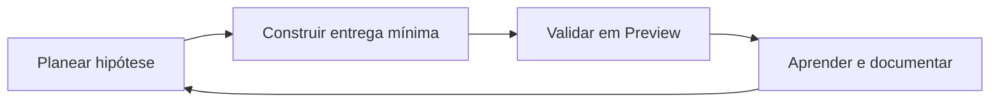

# Startup Operating System (SOS) — GlobalHire AI

## Ciclo Plan → Build → Learn

### 1. Planear

- Hipótese + métrica de sucesso + prazo — ver [`PRODUTO/experimentation-framework.md`](../PRODUTO/experimentation-framework.md)
- Alinhar com risco legal se dados ou marketing sensível.

### 2. Construir

- PRs pequenos; preview obrigatório na Vercel.
- QA: cruzar com [`docs/PREVIEW_QA_REPORT.md`](../../docs/PREVIEW_QA_REPORT.md) quando aplicável.

### 3. Validar

- `RUNBOOKS/post-deploy-validation.md`
- Monitorização nas primeiras 24–48h (erros, billing, analytics).

### 4. Aprender

- Retro interna (15–30 min): o que manter, o que reverter, o que medir a seguir.
- Atualizar roadmap — [`PRODUTO/roadmap.md`](../PRODUTO/roadmap.md)

## Rituais mínimos

| Ritual | Frequência | Owner |
|--------|------------|-------|
| Weekly founder review | Semanal | [`EXECUTIVO/weekly-founder-review.md`](../EXECUTIVO/weekly-founder-review.md) |
| Limpeza de backlog | Quinzenal | Produto |
| Revisão de custos | Mensal | Founder |

## Integração com documentação existente

- Deploy: [`docs/operations/SOP_DEPLOYMENT.md`](../../docs/operations/SOP_DEPLOYMENT.md)
- Bugs: [`docs/operations/SOP_BUG_RESPONSE.md`](../../docs/operations/SOP_BUG_RESPONSE.md)
