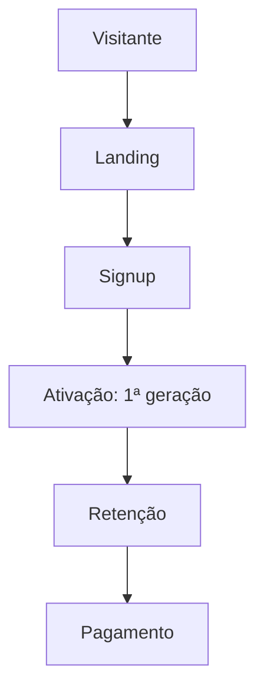

# Funis de aquisição

## Funil principal (macro)

## Eventos a medir

- Ver instrumentação: [`docs/ANALYTICS_EVENTS.md`](../../docs/ANALYTICS_EVENTS.md)

## Canais

| Canal | Notas |
|-------|-------|
| Orgânico | SEO + LinkedIn |
| Pago | Ativar quando unit economics definidos — `FINANCEIRO/unit-economics.md` |

## Leaks comuns

- Fricção no signup — revisar auth flow docs.
- Desconfiança na IA — messaging + limitações.
