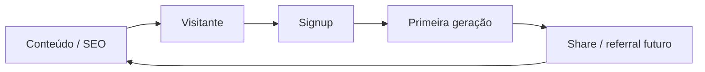

# Growth playbook (loops e experimentação)

## Loops recomendados

## Experimentos (ligação com produto)

- Framework: [`PRODUTO/experimentation-framework.md`](../PRODUTO/experimentation-framework.md)
- Instrumentação: [`docs/TRACKING_EVENTS.md`](../../docs/TRACKING_EVENTS.md)

## Hipóteses típicas early-stage

| Hipótese | Métrica | Duração mínima |
|----------|---------|----------------|
| Novo hero na landing | Signup rate | 2 semanas |
| Novo CTA no gerador | Conclusão de geração | 2 semanas |

## Crescimento pago (quando ativar)

- Definir CAC máximo aceitável e criativo por canal **antes** de escalar spend.
