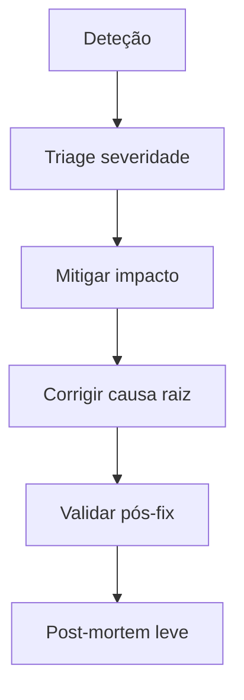

# SOP — Resposta a incidentes

**Fonte canónica:** [`docs/security/INCIDENT_RESPONSE.md`](../../docs/security/INCIDENT_RESPONSE.md)  
**Suporte:** [`docs/operations/SOP_BUG_RESPONSE.md`](../../docs/operations/SOP_BUG_RESPONSE.md)

## Severidade

| Sev | Sintomas | Impacto | Primeira ação |
|-----|----------|---------|----------------|
| SEV1 | Site inacessível ou dados em risco | Crítico | `production-emergency.md` |
| SEV2 | Billing ou IA em massa a falhar | Alto | Isolar Stripe/Groq; ver runbooks |
| SEV3 | Bug limitado a feature | Médio | Ticket + hotfix |

## Fluxo

## Diagnóstico rápido (ordem)

1. Vercel — deploy recente, logs 5xx, latência.
2. Supabase — status, quotas, auth.
3. Stripe — webhooks failed, modo live vs test.
4. Groq — quota / erros de API.

## Comunicação

- Utilizadores: mensagem honesta + ETA quando possível.
- Dados pessoais envolvidos: [`SEGURANCA_COMPLIANCE/privacy-operations.md`](../SEGURANCA_COMPLIANCE/privacy-operations.md)

## Encerramento

- [ ] Métricas voltaram ao normal
- [ ] Runbook atualizado se novo passo descoberto
- [ ] Ação de prevenção criada (ticket)
