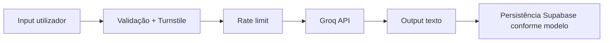

# Pipeline de IA (produto)

**Fontes canónicas:** [`docs/product/ATS_OPTIMIZATION_LOGIC.md`](../../docs/product/ATS_OPTIMIZATION_LOGIC.md), [`docs/product/AI_LIMITATIONS.md`](../../docs/product/AI_LIMITATIONS.md)

## Entradas típicas (conceituais)

| Entrada | Onde entra | Risco |
|---------|------------|-------|
| Texto de currículo | Gerador, ATS, upload | PII — não logar em analytics |
| Descrição de vaga | Gerador, ATS | Conteúdo confidencial cliente |
| Idioma, país-alvo, tipo | Payload API | Baixo |
| Turnstile token | APIs IA | Segredo efémero |

## Etapas do pipeline

## Rotas envolvidas

- `POST /api/ai/generate`
- `POST /api/ai/regenerate`
- `POST /api/ai/optimize-from-score`

## Governança e custo

- `IA_AUTOMACOES/ai-governance.md`
- `IA_AUTOMACOES/ai-cost-control.md`
- Biblioteca de prompts: `IA_AUTOMACOES/prompts-library.md` (referencia `prompts/` no repo)

## Limitações comunicáveis

- Ver limitações canónicas para não “oversell” em marketing — [`docs/product/AI_LIMITATIONS.md`](../../docs/product/AI_LIMITATIONS.md)
