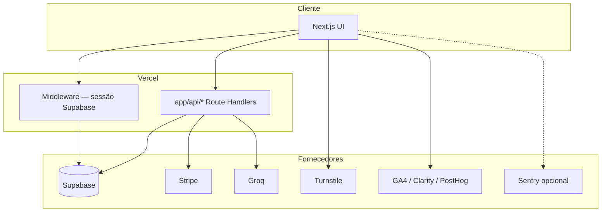

# Arquitetura — visão consolidada (GlobalHire AI)

**Fontes canónicas:** [`docs/ARCHITECTURE.md`](../../docs/ARCHITECTURE.md), [`docs/infra/SYSTEM_ARCHITECTURE.md`](../../docs/infra/SYSTEM_ARCHITECTURE.md)

## Stack confirmada (código + docs)

| Camada | Tecnologia |
|--------|------------|
| UI | Next.js 15 App Router, React 19, TypeScript, Tailwind |
| Runtime | Node (Route Handlers), Edge onde aplicável |
| Auth / DB | Supabase (Auth + Postgres + RLS) |
| Pagamentos | Stripe (Checkout, Portal, Webhook) |
| IA | Groq (`groq-sdk`) |
| Ficheiros | `pdf-parse`, `mammoth` (upload servidor) |
| Bot/abuse | Cloudflare Turnstile |
| Hosting | Vercel |
| Analytics | GA4, Microsoft Clarity, PostHog |
| Erros (opcional) | `@sentry/nextjs` (standby — ver [`docs/SENTRY_SETUP.md`](../../docs/SENTRY_SETUP.md)) |

## Diagrama lógico

## Fronteiras de confiança

- **Secrets:** apenas variáveis servidor; nunca `NEXT_PUBLIC_*` para credenciais.
- **CSP e origem:** headers e validação de origem em APIs sensíveis — ver [`docs/HARDENING_SECURITY.md`](../../docs/HARDENING_SECURITY.md), [`docs/PRODUCTION_HARDENING.md`](../../docs/PRODUCTION_HARDENING.md).

## Áreas de produto (alto nível)

Landing pública, auth, dashboard, gerador IA, ATS score, histórico/documentos, conta/assinatura, admin, APIs — conforme [`docs/ARCHITECTURE.md`](../../docs/ARCHITECTURE.md).

## Lacunas a monitorizar (não são bloqueios automáticos)

- Dependência de quota Groq e limites de rate — `IA_AUTOMACOES/ai-cost-control.md`
- i18n parcial em páginas marketing — referido em auditorias em `docs/`
