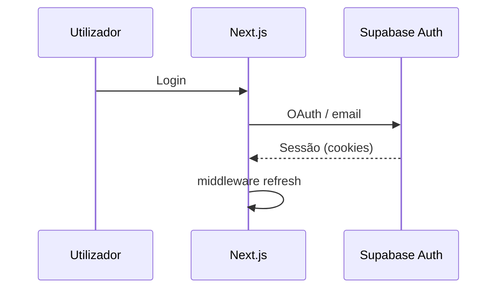

# Fluxo de autenticação (enterprise)

**Fonte canónica:** [`docs/AUTH_FLOW.md`](../../docs/AUTH_FLOW.md)  
**OAuth:** [`docs/OAUTH_SETUP.md`](../../docs/OAUTH_SETUP.md), [`docs/GOOGLE_OAUTH_REVIEW.md`](../../docs/GOOGLE_OAUTH_REVIEW.md)

## Componentes

| Peça | Ficheiro / local |
|------|------------------|
| Sessão SSR | `middleware.ts` — `createServerClient` Supabase |
| Callback | `app/auth/callback/route.ts` |
| Sign out | `app/api/auth/signout/route.ts` |

## Fluxo simplificado

## Checklist operacional (auth)

- [ ] URLs de redirect OAuth alinhados a **Preview** e **Production** nos providers.
- [ ] Cookies e domínio consistentes com `NEXT_PUBLIC_APP_URL`.
- [ ] RLS no Supabase ativo para dados utilizador — [`docs/RLS_AUDIT.md`](../../docs/RLS_AUDIT.md)

## Runbook de emergência

Ver [`RUNBOOKS/auth-emergency.md`](../RUNBOOKS/auth-emergency.md).
