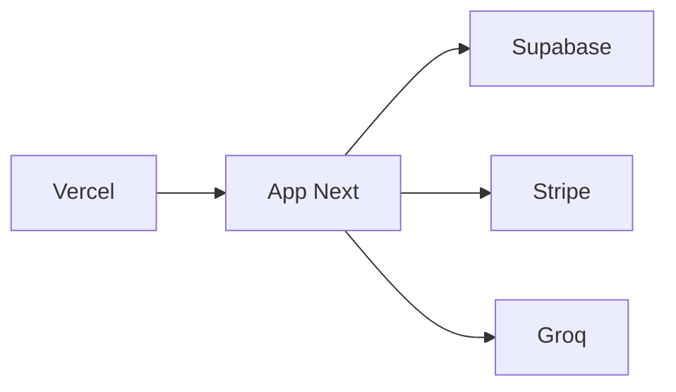

# Infraestrutura — visão geral

**Fontes canónicas:** [`docs/infra/DEPLOY_FLOW.md`](../../docs/infra/DEPLOY_FLOW.md), [`docs/DEPLOYMENT.md`](../../docs/DEPLOYMENT.md), [`docs/VERCEL_PREVIEW_CHECKLIST.md`](../../docs/VERCEL_PREVIEW_CHECKLIST.md)

## Fornecedores críticos

| Fornecedor | Função | Painel |
|------------|--------|--------|
| Vercel | Hosting, builds, previews, env, edge | Vercel Dashboard |
| Supabase | Auth, Postgres, RLS | Supabase Dashboard |
| Stripe | Subscrições, webhooks | Stripe Dashboard |
| Cloudflare | Turnstile | Cloudflare Dashboard |
| Groq | Inferência IA | Groq Console |
| Google / Microsoft / PostHog | Analytics | respetivos dashboards |

## Ambientes

| Ambiente | Notas |
|----------|--------|
| **Produção** | Domínio próprio; `NEXT_PUBLIC_APP_URL` alinhado |
| **Preview** | Origens e `getAppUrl` — ver [`docs/PREVIEW_QA_REPORT.md`](../../docs/PREVIEW_QA_REPORT.md) (CSRF / preview) |
| **Local** | `.env.local` (nunca commitar) |

## DNS e domínio

- Configuração comercial de domínio: fora do repo; manter registo no painel do registrar.

## Dependência de cadeia

**Ponto único de falha composto:** indisponibilidade Vercel bloqueia tudo; mitigação = comunicação de estado + incident runbooks.
