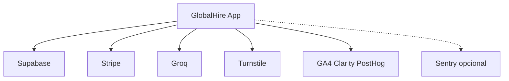

# Mapa de integrações

**Inventário baseado em:** `app/api/**`, `middleware.ts`, `package.json`, `docs/legal/THIRD_PARTY_SERVICES.md`.

## Tabela mestre

| Integração | Entrada no projeto | Dados sensíveis | Runbook |
|------------|---------------------|-----------------|---------|
| Supabase Auth + DB | `@supabase/ssr`, `middleware.ts`, callbacks | Conta, perfil, gerações | `RUNBOOKS/supabase-failure.md` |
| Stripe | `stripe` SDK, `app/api/stripe/*` | Pagamentos, customer id | `RUNBOOKS/stripe-failure.md` |
| Groq | `groq-sdk`, rotas `/api/ai/*` | Currículo, vaga, output IA | `IA_AUTOMACOES/ai-cost-control.md` |
| Turnstile | widget + `app/api/security/turnstile` | Tokens desafio | `docs/TURNSTILE_SETUP.md` |
| GA4 / Clarity / PostHog | scripts cliente | Comportamento agregado | `RUNBOOKS/analytics-debugging.md` |
| Sentry | `@sentry/nextjs`, túnel `/monitoring` | Stack traces (filtrados) | `docs/SENTRY_SETUP.md` |
| Vercel | hosting | Logs, builds | `RUNBOOKS/vercel-failure.md` |

## Diagrama de dependências

## Terceiros (legal)

- Lista contratual / DPIA: [`docs/legal/THIRD_PARTY_SERVICES.md`](../../docs/legal/THIRD_PARTY_SERVICES.md)
- Mapa de dados terceiros: [`docs/compliance/THIRD_PARTY_DATA_MAP.md`](../../docs/compliance/THIRD_PARTY_DATA_MAP.md)
