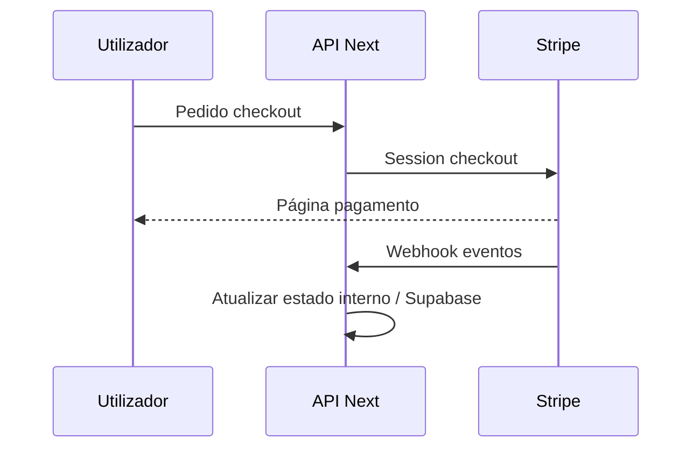

# Fluxo de pagamentos (Stripe)

**Fontes canónicas:** variáveis em [`docs/ENVIRONMENT_VARIABLES.md`](../../docs/ENVIRONMENT_VARIABLES.md); fluxo legal em `docs/legal/` quando aplicável.

## Componentes Stripe no código

| Peça | Rota / uso |
|------|------------|
| Checkout | `app/api/stripe/checkout/route.ts` |
| Portal | `app/api/stripe/portal/route.ts` |
| Webhook | `app/api/stripe/webhook/route.ts` |
| Sincronização | `app/api/subscription/sync/route.ts` |

## Variáveis críticas (nomes atuais do projeto)

- `STRIPE_SECRET_KEY`, `STRIPE_WEBHOOK_SECRET`, `NEXT_PUBLIC_STRIPE_PUBLISHABLE_KEY`
- Price IDs públicos: `NEXT_PUBLIC_STRIPE_STARTER_PRICE_ID`, `NEXT_PUBLIC_STRIPE_PRO_PRICE_ID`, `NEXT_PUBLIC_STRIPE_ELITE_PRICE_ID`  
  **Nota:** não renomear sem refatorar código (ver env docs).

## Fluxo simplificado

## Runbooks

- Falhas Stripe: [`RUNBOOKS/stripe-failure.md`](../RUNBOOKS/stripe-failure.md)
- Rollback: [`RUNBOOKS/rollback-procedures.md`](../RUNBOOKS/rollback-procedures.md)

## Política interna

- **Nunca** testar webhooks de produção com secrets de teste misturados.
- Manter modo **test** em Preview quando possível — referência operacional em [`docs/PREVIEW_QA_REPORT.md`](../../docs/PREVIEW_QA_REPORT.md).
