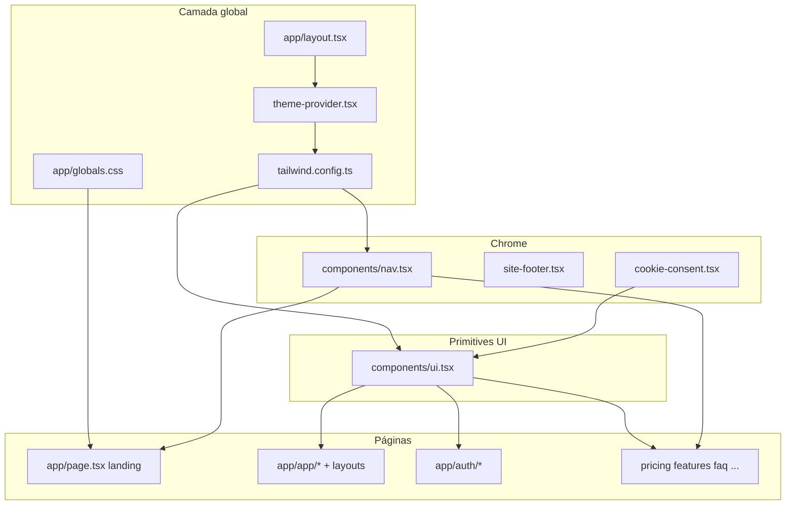

# 3 — Onde cada aspecto visual é controlado

## Cores primárias e secundárias

| Aspecto | Onde | Como |
|---------|------|------|
| Paleta Tailwind (`ink`, `graphite`, `paper`, `brand-*`, `mint`, `cyber`, …) | [`tailwind.config.ts`](../../tailwind.config.ts) | `theme.extend.colors` |
| Variáveis CSS (`--gh-ink`, `--gh-brand`, …) | [`app/globals.css`](../../app/globals.css) | `:root` — usadas em selection/autofill |
| Cores “sem token” (hex) | Vários `.tsx` + `globals.css` | Ex.: `#06100B`, `#07120E`, `#1a222d` em cookie, nav dark, inputs |

## Gradientes

| Onde | Ficheiro | Detalhe |
|------|----------|---------|
| Fundo landing (radial + linear) | [`app/globals.css`](../../app/globals.css) | `html.dark .brand-shell` / `html:not(.dark) .brand-shell` |
| Grelha sobreposta | `globals.css` | `.brand-grid` linear-gradients + `mask-image` |
| Hero card accent | [`app/page.tsx`](../../app/page.tsx) | `bg-gradient-to-r from-transparent via-brand-500` |
| Main app dark | [`app/(app)/layout.tsx`](../../app/(app)/layout.tsx) | `dark:bg-[linear-gradient(180deg,#050806_0%,#07120E_100%)]` |

## Backgrounds

| Contexto | Controlo |
|----------|----------|
| Body global | [`app/layout.tsx`](../../app/layout.tsx): `bg-paper` … `dark:bg-ink` |
| Landing | `page.tsx` → `main.brand-shell` + CSS em `globals.css` |
| Marketing/legal | `bg-paper` / `dark:bg-ink` por página ou `LegalPage` |
| Cards | [`components/ui.tsx`](../../components/ui.tsx) `cardSurface` |
| Cookie banner | [`components/cookie-consent.tsx`](../../components/cookie-consent.tsx) `bg-[#06100B]/95` |

## Botões

| Tipo | Controlo |
|------|----------|
| Primário default | `components/ui.tsx` → `Button` classes (`bg-brand-500`, `hover:bg-brand-200`, `shadow-glow`) |
| Variantes (outline, ghost) | `className` override no uso (landing, cookie) |

## Sombras

| Token | Definição |
|-------|-----------|
| `shadow-soft` | `tailwind.config.ts` |
| `shadow-glow` | idem |
| Sombra extra em `Card` light | Inline em `ui.tsx`: `shadow-[0_24px_80px_rgba(0,0,0,0.08)]` |

## Border radius

- Global Tailwind default (`rounded-md`, `rounded-lg`) — **sem** `borderRadius` extend em `tailwind.config.ts`.
- Documentação alvo em [`docs/design-system/tokens.md`](../design-system/tokens.md) (6px/8px) **não** forçada no config.

## Dark mode

| Peça | Controlo |
|------|----------|
| Estratégia | `darkMode: "class"` em `tailwind.config.ts` |
| Classe `dark` no `html` | [`components/theme-provider.tsx`](../../components/theme-provider.tsx) `document.documentElement.classList.toggle("dark", isDark)` |
| `color-scheme` | [`app/globals.css`](../../app/globals.css) `html` / `html.dark` / `html:not(.dark)` |
| Variantes `dark:` | Dispersas em componentes e páginas |

## Contraste e legibilidade

| Mecanismo | Ficheiro |
|-----------|----------|
| `Card` fundo branco opaco (light) | `components/ui.tsx` |
| `inputClass` fundos e autofill | `components/ui.tsx` + `globals.css` (::selection, webkit autofill) |
| Landing light: remap `text-white` → ink | `globals.css` sob `.brand-shell` |
| `<pre>` blocos (histórico/gerador/ATS) | Ajustes em componentes (ver QA) |

## Tipografia

| Aspecto | Controlo |
|---------|----------|
| Família base | `globals.css` → `Inter`, system stack |
| Pesos/tamanhos | Utilities por componente |
| `next/font` | **Não** presente — Inter depende de sistema/CDN implícito do browser stack (Inter pode não carregar se não houver fonte local) |

## Spacing

- Utilities Tailwind (`gap-*`, `p-*`, `max-w-7xl`) — **sem** spacing tokens extend no Tailwind config.

## Glassmorphism / blur

- `backdrop-blur` / `backdrop-blur-xl`: `Card` (`ui.tsx`), `PublicNav`/`AppNav` header (`nav.tsx`), `cookie-consent.tsx`.

## Animações

- `transition`, `duration-200`, `hover:-translate-y-0.5`, `animate-spin` — em `ui.tsx`, landing cards, loaders.

## Hover states

- Co-localizados com componentes (`hover:bg-*`, `group-hover:` em dropdowns `nav.tsx`).

## Cards, containers

- **`Card`**: único primitive principal.
- **Containers**: `max-w-7xl mx-auto px-4 sm:px-6` repetido em várias páginas (padrão manual, não component `<PageContainer>`).

## Navbar

- **Único ficheiro:** [`components/nav.tsx`](../../components/nav.tsx).

## Hero, CTA, footer

| Elemento | Controlo |
|----------|------------|
| Hero landing | `app/page.tsx` primeira `section` |
| CTAs | `Button` + links estilados inline |
| Footer | `components/site-footer.tsx`; a landing usa **`SiteFooter locale={locale}`** (client, alinhado ao `LanguageProvider`); áreas app/auth usam **`AutoSiteFooter`** |

---

# 4 — Mapa de dependências visuais

## Ficheiros globais (efeito cascata total)

1. `tailwind.config.ts`
2. `app/globals.css`
3. `app/layout.tsx` (body + metadata)
4. `components/theme-provider.tsx`
5. `components/ui.tsx`

## Herança e reutilização

- **`Button` / `Card` / `inputClass`**: herdados por **auth**, **app**, **legal**, **pricing**, **marketing**.
- **`PublicNav`**: landing, legal, pricing, features, faq, resources.
- **`AppNav` + `(app)/layout`**: todas rotas `(app)/*`.
- **`AutoSiteFooter`**: auth + app; páginas marketing chamam explicitamente.

## Mudanças que quebram múltiplas páginas

- Alterar **cores** em `tailwind.config.ts` → todas as utilities `brand-*`, `ink`, etc.
- Alterar **`Card`** → dashboard, auth, legal, pricing, landing (cards).
- Alterar **`brand-shell` overrides** → landing light mode inteira.
- Remover **`dark` class strategy** → todas variantes `dark:`.

## Tokens / classes de alcance project-wide

- `bg-paper`, `text-ink`, `dark:bg-ink`, `dark:text-white`
- `border-graphite/15`, `dark:border-white/10`
- `focus-ring` (classe CSS em `globals.css`)

## Componentes críticos (grafos de impacto)

## Estilos duplicados (débito)

- Padrão `max-w-7xl px-4 sm:px-6` repetido (não centralizado).
- Superfícies `border-graphite/15 bg-graphite/[0.05] dark:border-white/10 dark:bg-white/5` repetidas em dashboard, history, ATS, admin.
- Hex dark em vários sítios em vez de token semântico único (`surface-elevated`, etc. — **não existem** hoje).

---

*Capítulos B (mapa de ficheiros detalhado) e C (diagrama) do deliverable; checklist em [`07-plano-rebranding-e-checklist.md`](./07-plano-rebranding-e-checklist.md).*
